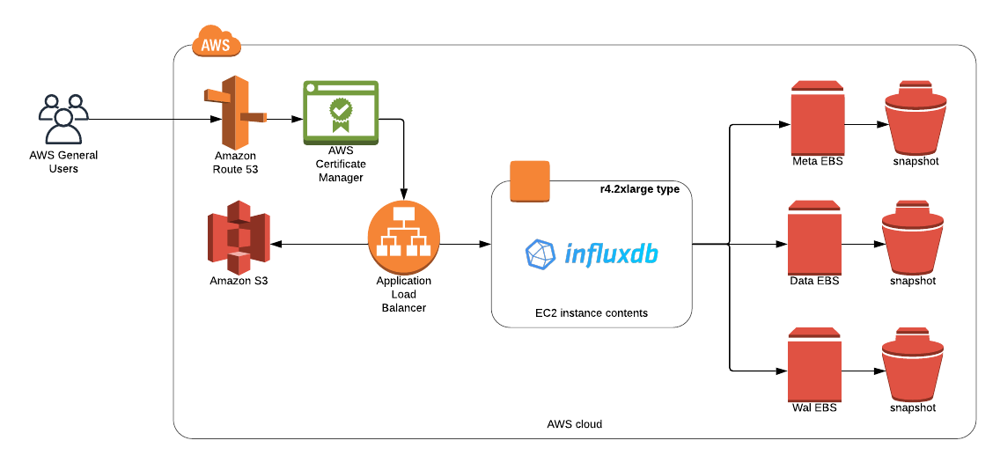

# InfluxDB Module



## Resources used
```
terraform-module-ec2
terraform-module-S3
terraform-module-acm
terraform-module-iam-role
aws_ebs_volume
aws_volume_attachment
aws_route53_record
aws_security_group
aws_dlm_lifecycle_policy
```
## What it does

Create an InfluxDB instance with Application load balancer, Amazon Certificate.


## Inputs

| Name                           | Description                                                                                                                                                                 |  Type  |  Default                  | Required |
| ------------------------------ | --------------------------------------------------------------------------------------------------------------------------------------------------------------------------- | :----: | :-----------------------: | :------: |
| name                           | Name to be used on all resources as prefix                                                                                                                                  |        |  `influx`                 |    no    |
| tags                           | Map of tags to add to resources                                                                                                                                             |  map   |                           |   yes    |
| vpc_name                       | Name of the vpc that the resource is being created in                                                                                                                       | string |     {}                    |   yes    |
| env_name                       | environment name being deployed. this is used in part for ALB access log S3 bucket, so make sure it's unique                                                                | string |     ""                    |   yes    |
| vpc_id                         | Id of the VPC influxdb will be provisioned in                                                                                                                               |        |     ""                    |   yes    |
| ami_release_tag                | Tag of the packer image to filter for. Example 1.0.0                                                                                                                        |        |     ""                    |   yes    |
| subnet_id                      | List of Subnet ID for server                                                                                                                                                | list   |     []                    |   yes    |
| data_instance_type             | Defaults to r4.xlarge                                                                                                                                                       |        | `r4.xlarge`               |    no    |
| zone_id                        | Private DNS zone to create records for host                                                                                                                                 |        |     ""                    |   yes    |
| dns_name                       | Name of the record for Route53                                                                                                                                              | string |     ""                    |   yes    |
| s3_bucket_name                 | S3 bucket name                                                                                                                                                              | string |     ""                    |   yes    |
| data_node_cidrs                | Cidr block for data node access                                                                                                                                             | string |     ""                    |   yes    |
| https_cidr_block               | HTTPS input cidr block for Load balancer access                                                                                                                             | string |     ""                    |   yes    |
| enable_lb_route_53_entry       | Do you wish to create a route53 entry for dns or not (1 or 0)                                                                                                               | number |     1                     |    no    |
| data_disk_size                 | Size of the data disks to provision [Ensure data_disk_iops:data_disk_size Ratio = 50:1]                                                                                     | number |    300                    |    no    |
| data_disk_iops                 | Number of IOPs for the io1 type volume [Ensure data_disk_iops:data_disk_size Ratio = 50:1]                                                                                  | number |   1000                    |    no    |
| wal_disk_size                  | Size of the wal disks to provision [Ensure wal_disk_iops:wal_disk_size Ratio = 50:1]                                                                                        | number |    100                    |    no    |
| wal_disk_iops                  | Number of IOPs for the io1 type volume [Ensure wal_disk_iops:wal_disk_size Ratio = 50:1]                                                                                    | number |   3000                    |    no    |
| meta_disk_size                 | Size of the wal disks to provision                                                                                                                                          | number |    100                    |    no    |
| data_disk_device_name          | Name of the data device                                                                                                                                                     | string | `/dev/xvdh`               |    no    |
| wal_disk_device_name           | Name of the wal device                                                                                                                                                      | string | `/dev/xvdg`               |    no    |
| meta_disk_device_name          | Name of the meta device                                                                                                                                                     | string | `/dev/xvdi`               |    no    |
| data_disk_snaphot              | Snapshot ID to restore Data volume from                                                                                                                                     | string |     ""                    |    no    |
| wal_disk_snaphot               | Snapshot ID to restore Wal volume from                                                                                                                                      | string |     ""                    |    no    |
| meta_disk_snaphot              | Snapshot ID to restart Meta volume from                                                                                                                                     | string |     ""                    |    no    |
| snapshot_interval              | How often this lifecycle policy should be evaluated. 2,3,4,6,8,12 or 24 are valid values                                                                                    |        |   `24`                    |    no    |
| snapshot_start_time            | List of times in 24 hour clock format that sets when the lifecycle policy should be evaluated                                                                               |        |  `00:00`                  |    no    |
| retain_rule                    | How many snapshots to keep. Must be an integer between 1 and 1000                                                                                                           |        |    `3`                    |    no    |
| influxdb_lb_ideal_timeout      | The time in seconds that the connection is allowed to be idle                                                                                                               |        |    `60`                   |    no    |
| force_detach                   | Set to true if you want to force the volume to detach. Useful if previous attempts failed, but use this option only as a last resort, as this can result in data loss       | string |  `false`                  |    no    |
| force_destroy_s3               | Allow terraform to force destroy the S3 bucket used for ALB access logs                                                                                                     | string |  `false`                  |    no    |
| buffer_size                    | The OS and UDP read-buffers. default is 200MB                                                                                                                               | string | `209715200`               |    no    |
| data_base                      | Name of database to create in Influxdb. Default is influxdb.                                                                                                                | string | `influxdb`                |    no    |
| batch_timeout                  | UDP Batch timeout. Default 1s                                                                                                                                               | string |   `1s`                    |    no    |
| batch_pending                  | UDP Batch Pending. Default is 5                                                                                                                                             | string |   `5`                     |    no    |
| batch_size                     | UDP Batch Size. Default is 1000                                                                                                                                             | string |   `1000`                  |    no    |
| duration                       | Amount of time to keep the data in the database. Can be in Hours or Days, ie 48h or 90d respectively                                                                        | string |`90d`                      |    no    |
| debug_duration                 | Amount of time to keep the data in the debug database. Can be in Hours or Days, ie 48h or 90d respectively                                                                  | string |`48h`                      |    no    |

## OUTPUT VALUE NAMES

| Name                   | Description                                               |
| ---------------------- | --------------------------------------------------------- |
| influxdb_id            | ID of Data node EC2 instance                              |
| influxdb_ip            | Private IP address of index 0 for backwards compatibility |
| influxdb_lb_fqdn       | Private IP address of index 0 for backwards compatibility |

## Backup/Restore Process ##
Backups are down via ebs snapshots, which by default happen every 24 hrs at 00:00. By Default we keep 3 snapshots. These can all be changed by the `snapshot_interval`, `snapshot_start_time` and `retain_rule` variables to what ever your needs are.

To Restore, you simply need to provide the snapshot ID's for teh data ebs, wal ebs and meta ebs volumes. The Variables that need to be populated are as follows:
`data_disk_snaphot`
`wal_disk_snaphot`
`meta_disk_snaphot`

When those values are provided terraform will destroy and recreate your ebs volumes and populate the new ones with the data in the snapshot ID you provided.

## NOTE ##

On initial provisioning, there is a fair amount of self configuration that takes place. Please give the instance a couple of minutes after terraform completes for the app to self configure.

## NOTE ##

To perform health check after deployment please use `curl -sl -I https://<dns_name>/ping` and it should return StatusCode: `204`
